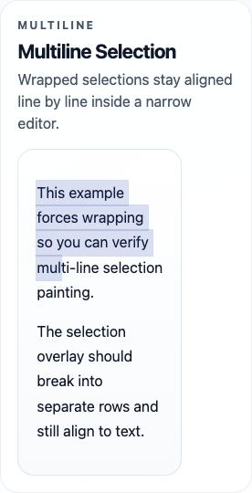
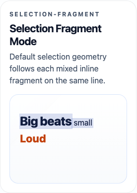
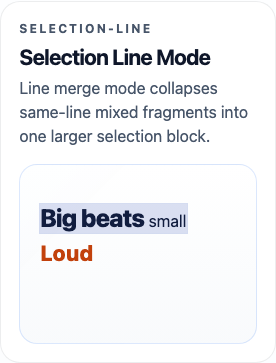
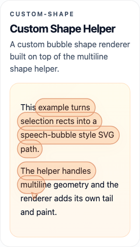

# Caret

Custom caret and selection overlays for a single DOM subtree.

Use it when you want to:

- draw your own caret
- draw your own selection highlight
- keep using native `contenteditable`
- style the overlay with CSS or replace the renderer entirely

## Packages

- `@caret/dom`: DOM API
- `@caret/react`: React wrapper
- `@caret/core`: low-level model and geometry helpers

## Install

```bash
npm install @caret/dom
```

React:

```bash
npm install @caret/react
```

## Quick Start

### DOM

```ts
import { attachCaret } from '@caret/dom'

const root = document.querySelector('[contenteditable]') as HTMLElement

const caret = attachCaret({ root })
caret.mount()
```

`root` is the boundary for the whole library. Everything under that subtree is treated as one caret/selection surface.

### React

```tsx
import { CaretRoot } from '@caret/react'

export function Editor() {
  return (
    <CaretRoot>
      <div contentEditable suppressContentEditableWarning>
        <p>Hello world</p>
        <p>Select this text.</p>
      </div>
    </CaretRoot>
  )
}
```

## Examples

### Basic Overlay


Default renderer, no extra styling:

```tsx
import { CaretRoot } from '@caret/react'

export function Editor() {
  return (
    <CaretRoot>
      <div contentEditable suppressContentEditableWarning>
        <p>Try selecting this text.</p>
        <p>The default overlay should appear on top of the content.</p>
      </div>
    </CaretRoot>
  )
}
```

### Multiline Selection



Wrapped selections are rendered as multiple overlay rows:

```tsx
import { CaretRoot } from '@caret/react'

export function Editor() {
  return (
    <CaretRoot>
      <div
        className="example-editor--narrow"
        contentEditable
        suppressContentEditableWarning
      >
        <p>This example forces wrapping so you can verify multi-line selection painting.</p>
      </div>
    </CaretRoot>
  )
}
```

```css
.example-editor--narrow {
  max-width: 180px;
}
```

### Selection Merge Strategies

Default `fragment` mode keeps mixed inline fragments separate on the same line:



```ts
import { attachCaret } from '@caret/dom'

const caret = attachCaret({
  root,
  selection: {
    mergeStrategy: 'fragment'
  }
})

caret.mount()
```

Use `line` mode when you want one continuous block per wrapped line:



```tsx
import { CaretRoot } from '@caret/react'

export function Editor() {
  return (
    <CaretRoot
      selection={{
        mergeStrategy: 'line'
      }}
    >
      <div contentEditable suppressContentEditableWarning>
        <p>
          <span style={{ fontSize: '1.55em', fontWeight: 800 }}>Big beats</span>
          <span> small </span>
          <span style={{ fontSize: '1.35em', fontWeight: 800 }}>Loud</span>
        </p>
      </div>
    </CaretRoot>
  )
}
```

`fragment` is more faithful to mixed inline geometry. `line` is visually simpler and closer to a single editor-style highlight band.

`caret.blink` is optional. If you omit it, the custom caret stays static.

### CSS Styled Overlay


Use the built-in renderer, but tune the appearance directly:

```tsx
import { CaretRoot } from '@caret/react'
import { createOverlayRenderer } from '@caret/dom'

export function Editor() {
  return (
    <CaretRoot
      createRenderer={(host) =>
        createOverlayRenderer(host, {
          caret: {
            width: 3,
            color: '#0f172a',
            radius: 3,
            blink: {
              onMs: 530,
              offMs: 530
            }
          },
          selection: {
            background: 'rgba(37, 99, 235, 0.2)',
            outline: '1px solid rgba(37, 99, 235, 0.4)',
            radius: 8,
            shape: {
              kind: 'pill',
              paddingX: 4,
              paddingY: 2
            }
          },
          classNames: {
            root: 'styled-overlay',
            caret: 'styled-overlay__caret',
            selection: 'styled-overlay__selection'
          }
        })
      }
    >
      <div className="example-editor--styled" contentEditable suppressContentEditableWarning>
        <p>A thinner caret can feel more editor-like.</p>
        <p>Use renderer options for pill shapes, radius, color, and outline without replacing the renderer.</p>
      </div>
    </CaretRoot>
  )
}
```

```css
.styled-overlay {
  filter: saturate(1.05);
}
```

### Custom Shape Helper



Use the helper output inside your own SVG renderer when you want something more expressive than plain rectangles:

```tsx
import { CaretRoot } from '@caret/react'
import { buildSelectionShapePath, type OverlayRenderer } from '@caret/dom'

function createBubbleRenderer(host: HTMLElement): OverlayRenderer {
  const root = document.createElementNS('http://www.w3.org/2000/svg', 'svg')

  return {
    root: root as unknown as HTMLElement,
    render({ visualState }) {
      if (!root.parentNode) {
        host.appendChild(root)
      }

      root.replaceChildren()
      root.setAttribute('viewBox', `0 0 ${host.clientWidth} ${host.clientHeight}`)

      const shape = buildSelectionShapePath(visualState.selectionRects, {
        kind: 'pill',
        paddingX: 6,
        paddingY: 4
      })

      if (shape.bounds) {
        const path = document.createElementNS('http://www.w3.org/2000/svg', 'path')
        const tailStartX = shape.bounds.x + Math.min(28, shape.bounds.width * 0.3)
        const tailBaseY = shape.bounds.y + shape.bounds.height
        const tail = `M ${tailStartX} ${tailBaseY - 2} L ${tailStartX + 12} ${tailBaseY + 2} L ${tailStartX + 4} ${tailBaseY + 12} Z`

        path.setAttribute('d', `${shape.path} ${tail}`)
        path.setAttribute('fill', 'rgba(249, 115, 22, 0.18)')
        path.setAttribute('stroke', 'rgba(194, 65, 12, 0.45)')
        root.appendChild(path)
      }
    },
    destroy() {
      root.remove()
    }
  }
}
```

### Custom Renderer


Replace the renderer when CSS is not enough:

```tsx
import { CaretRoot } from '@caret/react'
import type { OverlayRenderer } from '@caret/dom'

function createMintRenderer(host: HTMLElement): OverlayRenderer {
  const root = document.createElement('div')
  root.style.position = 'absolute'
  root.style.inset = '0'
  root.style.pointerEvents = 'none'

  return {
    root,
    render({ visualState }) {
      if (!root.parentNode) {
        host.appendChild(root)
      }

      root.replaceChildren()

      for (const rect of visualState.selectionRects) {
        const el = document.createElement('div')
        el.style.position = 'absolute'
        el.style.left = `${rect.x}px`
        el.style.top = `${rect.y}px`
        el.style.width = `${rect.width}px`
        el.style.height = `${rect.height}px`
        el.style.background = 'linear-gradient(135deg, rgba(16, 185, 129, 0.18), rgba(20, 184, 166, 0.28))'
        el.style.border = '1px solid rgba(15, 118, 110, 0.42)'
        el.style.borderRadius = '8px'
        root.appendChild(el)
      }

      if (visualState.caret) {
        const el = document.createElement('div')
        el.style.position = 'absolute'
        el.style.left = `${visualState.caret.x}px`
        el.style.top = `${visualState.caret.y}px`
        el.style.width = '3px'
        el.style.height = `${visualState.caret.height}px`
        el.style.background = 'linear-gradient(180deg, #10b981, #0f766e)'
        el.style.borderRadius = '999px'
        root.appendChild(el)
      }
    },
    destroy() {
      root.remove()
    }
  }
}
```

## Styling

The default renderer draws two overlay parts:

- `data-caret-overlay-part="caret"`
- `data-caret-overlay-part="selection"`

It also supports CSS variables:

- `--caret-color`
- `--caret-radius`
- `--caret-selection-background`
- `--caret-selection-outline`
- `--caret-selection-radius`

For most styling, prefer renderer options:

- `caret.width`
- `caret.color`
- `caret.radius`
- `caret.blink`
- `selection.mergeStrategy`
- `selection.background`
- `selection.outline`
- `selection.radius`
- `selection.shape`

`selection.mergeStrategy` supports:

- `fragment`: keep mixed inline fragments separate on the same line
- `line`: merge same-line fragments into one larger selection block

`selection.shape` currently supports:

- `kind: 'rect' | 'pill'`
- `paddingX`
- `paddingY`
- `radius`

### Style With `createOverlayRenderer`

```ts
import { attachCaret, createOverlayRenderer } from '@caret/dom'

const caret = attachCaret({
  root,
  selection: {
    mergeStrategy: 'line'
  },
  createRenderer(host) {
    return createOverlayRenderer(host, {
      caret: {
        width: 3,
        color: '#111827',
        radius: 2,
        blink: {
          onMs: 530,
          offMs: 530,
          delayMs: 80
        }
      },
      selection: {
        background: 'rgba(59, 130, 246, 0.22)',
        outline: '1px solid rgba(59, 130, 246, 0.32)',
        radius: 8,
        shape: {
          kind: 'pill',
          paddingX: 4,
          paddingY: 2
        }
      },
      classNames: {
        root: 'caret-overlay',
        caret: 'caret-overlay__caret',
        selection: 'caret-overlay__selection'
      }
    })
  }
})

caret.mount()
```

```css
.caret-overlay__selection {
  box-shadow: 0 4px 10px rgba(59, 130, 246, 0.12);
}
```

### Build A Custom SVG/Canvas Shape

If you want to keep your own renderer, but reuse the built-in multiline shape helper:

```ts
import { buildSelectionShapePath } from '@caret/dom'

const shape = buildSelectionShapePath(visualState.selectionRects, {
  kind: 'pill',
  paddingX: 4,
  paddingY: 2
})

path.setAttribute('d', shape.path)
```

### React Styling

```tsx
import { CaretRoot } from '@caret/react'
import { createOverlayRenderer } from '@caret/dom'

export function Editor() {
  return (
    <CaretRoot
      selection={{
        mergeStrategy: 'line'
      }}
      createRenderer={(host) =>
        createOverlayRenderer(host, {
          caret: {
            width: 2,
            blink: {
              onMs: 530,
              offMs: 530
            }
          },
          classNames: {
            root: 'caret-overlay',
            caret: 'caret-overlay__caret',
            selection: 'caret-overlay__selection'
          }
        })
      }
    >
      <div contentEditable suppressContentEditableWarning>
        <p>Hello world</p>
      </div>
    </CaretRoot>
  )
}
```

## Common API

```ts
const caret = attachCaret({ root })

caret.mount()
caret.unmount()

caret.getSelection()
caret.setSelection(selection)
caret.setCollapsedPosition(position)
caret.setSelectionFromDOM()

caret.toDOMRange(selection)
caret.fromDOMRange(range)

caret.hitTest({ x, y })

caret.on('selectionchange', (selection) => {
  console.log(selection)
})
```

### Position Shape

```ts
type CaretPosition = {
  path: number[]
  offset: number
  affinity?: 'forward' | 'backward'
}
```

### Selection Shape

```ts
type CaretSelection = {
  anchor: CaretPosition
  focus: CaretPosition
}
```

## Unsupported Cases

Current fallback behavior:

- RTL roots are marked unsupported
- custom overlay is disabled in that case
- native browser selection/caret remains the fallback

You can check:

```ts
if (!caret.supportState.supported) {
  console.log(caret.supportState.reason)
}
```

## Notes

- Best fit is `contenteditable` with native input behavior still enabled.
- The library works on one root subtree at a time.
- The root will be promoted to `position: relative` while mounted if it is `position: static`.
- Regenerate README screenshots with `npm run capture:readme`.
