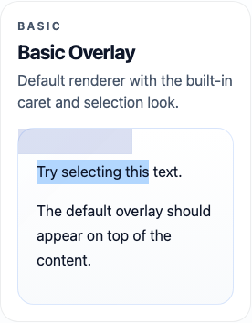
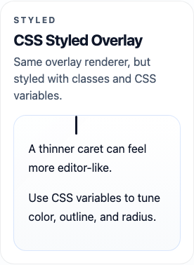
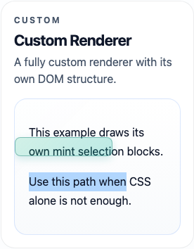

# Caret

Custom caret and selection overlays for a single DOM subtree.

Use it when you want to:

- draw your own caret
- draw your own selection highlight
- keep using native `contenteditable`
- style the overlay with CSS or replace the renderer entirely

## Packages

- `@caret/dom`: DOM API
- `@caret/react`: React wrapper
- `@caret/core`: low-level model and geometry helpers

## Install

```bash
npm install @caret/dom
```

React:

```bash
npm install @caret/react
```

## Quick Start

### DOM

```ts
import { attachCaret } from '@caret/dom'

const root = document.querySelector('[contenteditable]') as HTMLElement

const caret = attachCaret({ root })
caret.mount()
```

`root` is the boundary for the whole library. Everything under that subtree is treated as one caret/selection surface.

### React

```tsx
import { CaretRoot } from '@caret/react'

export function Editor() {
  return (
    <CaretRoot>
      <div contentEditable suppressContentEditableWarning>
        <p>Hello world</p>
        <p>Select this text.</p>
      </div>
    </CaretRoot>
  )
}
```

## Examples

### Basic Overlay



Default renderer, no extra styling:

```tsx
import { CaretRoot } from '@caret/react'

export function Editor() {
  return (
    <CaretRoot>
      <div contentEditable suppressContentEditableWarning>
        <p>Try selecting this text.</p>
        <p>The default overlay should appear on top of the content.</p>
      </div>
    </CaretRoot>
  )
}
```

### CSS Styled Overlay



Use the built-in renderer, but style it with classes and CSS variables:

```tsx
import { CaretRoot } from '@caret/react'
import { createOverlayRenderer } from '@caret/dom'

export function Editor() {
  return (
    <CaretRoot
      createRenderer={(host) =>
        createOverlayRenderer(host, {
          caretWidth: 3,
          classNames: {
            root: 'styled-overlay',
            caret: 'styled-overlay__caret',
            selection: 'styled-overlay__selection'
          }
        })
      }
    >
      <div className="example-editor--styled" contentEditable suppressContentEditableWarning>
        <p>A thinner caret can feel more editor-like.</p>
        <p>Use CSS variables to tune color, outline, and radius.</p>
      </div>
    </CaretRoot>
  )
}
```

```css
.example-editor--styled .styled-overlay__caret {
  --caret-color: #0f172a;
  --caret-radius: 3px;
}

.example-editor--styled .styled-overlay__selection {
  --caret-selection-background: rgba(37, 99, 235, 0.2);
  --caret-selection-outline: 1px solid rgba(37, 99, 235, 0.4);
}
```

### Custom Renderer



Replace the renderer when CSS is not enough:

```tsx
import { CaretRoot } from '@caret/react'
import type { OverlayRenderer } from '@caret/dom'

function createMintRenderer(host: HTMLElement): OverlayRenderer {
  const root = document.createElement('div')
  root.style.position = 'absolute'
  root.style.inset = '0'
  root.style.pointerEvents = 'none'

  return {
    root,
    render({ visualState }) {
      if (!root.parentNode) {
        host.appendChild(root)
      }

      root.replaceChildren()

      for (const rect of visualState.selectionRects) {
        const el = document.createElement('div')
        el.style.position = 'absolute'
        el.style.left = `${rect.x}px`
        el.style.top = `${rect.y}px`
        el.style.width = `${rect.width}px`
        el.style.height = `${rect.height}px`
        el.style.background = 'linear-gradient(135deg, rgba(16, 185, 129, 0.18), rgba(20, 184, 166, 0.28))'
        el.style.border = '1px solid rgba(15, 118, 110, 0.42)'
        el.style.borderRadius = '8px'
        root.appendChild(el)
      }

      if (visualState.caret) {
        const el = document.createElement('div')
        el.style.position = 'absolute'
        el.style.left = `${visualState.caret.x}px`
        el.style.top = `${visualState.caret.y}px`
        el.style.width = '3px'
        el.style.height = `${visualState.caret.height}px`
        el.style.background = 'linear-gradient(180deg, #10b981, #0f766e)'
        el.style.borderRadius = '999px'
        root.appendChild(el)
      }
    },
    destroy() {
      root.remove()
    }
  }
}
```

## Styling

The default renderer draws two overlay parts:

- `data-caret-overlay-part="caret"`
- `data-caret-overlay-part="selection"`

It also supports CSS variables:

- `--caret-color`
- `--caret-radius`
- `--caret-selection-background`
- `--caret-selection-outline`

### Style With `createOverlayRenderer`

```ts
import { attachCaret, createOverlayRenderer } from '@caret/dom'

const caret = attachCaret({
  root,
  createRenderer(host) {
    return createOverlayRenderer(host, {
      caretWidth: 3,
      classNames: {
        root: 'caret-overlay',
        caret: 'caret-overlay__caret',
        selection: 'caret-overlay__selection'
      }
    })
  }
})

caret.mount()
```

```css
.caret-overlay__caret {
  --caret-color: #111827;
  --caret-radius: 2px;
}

.caret-overlay__selection {
  --caret-selection-background: rgba(59, 130, 246, 0.22);
  --caret-selection-outline: 1px solid rgba(59, 130, 246, 0.32);
}
```

### React Styling

```tsx
import { CaretRoot } from '@caret/react'
import { createOverlayRenderer } from '@caret/dom'

export function Editor() {
  return (
    <CaretRoot
      createRenderer={(host) =>
        createOverlayRenderer(host, {
          caretWidth: 2,
          classNames: {
            root: 'caret-overlay',
            caret: 'caret-overlay__caret',
            selection: 'caret-overlay__selection'
          }
        })
      }
    >
      <div contentEditable suppressContentEditableWarning>
        <p>Hello world</p>
      </div>
    </CaretRoot>
  )
}
```

## Common API

```ts
const caret = attachCaret({ root })

caret.mount()
caret.unmount()

caret.getSelection()
caret.setSelection(selection)
caret.setCollapsedPosition(position)
caret.setSelectionFromDOM()

caret.toDOMRange(selection)
caret.fromDOMRange(range)

caret.hitTest({ x, y })

caret.on('selectionchange', (selection) => {
  console.log(selection)
})
```

### Position Shape

```ts
type CaretPosition = {
  path: number[]
  offset: number
  affinity?: 'forward' | 'backward'
}
```

### Selection Shape

```ts
type CaretSelection = {
  anchor: CaretPosition
  focus: CaretPosition
}
```

## Unsupported Cases

Current fallback behavior:

- RTL roots are marked unsupported
- custom overlay is disabled in that case
- native browser selection/caret remains the fallback

You can check:

```ts
if (!caret.supportState.supported) {
  console.log(caret.supportState.reason)
}
```

## Notes

- Best fit is `contenteditable` with native input behavior still enabled.
- The library works on one root subtree at a time.
- The root will be promoted to `position: relative` while mounted if it is `position: static`.
- Regenerate README screenshots with `npm run capture:readme`.
